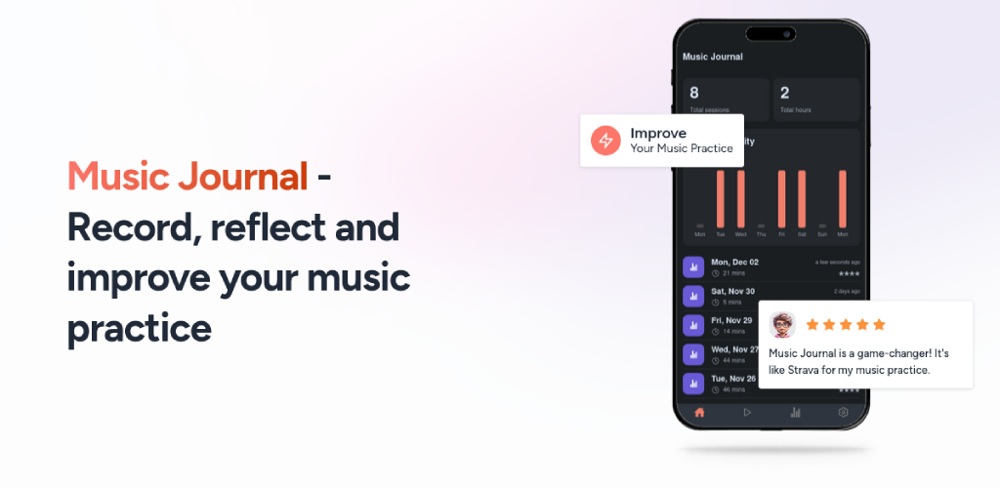

# Music Journal 🎵

Record, reflect and improve your music practice



[https://www.musicjournal.fm/](https://www.musicjournal.fm/)

## Features

Music Journal helps helps you transform your music practice. Like Strava for your music practice.

- **Record your Practice** - Easily record and track your practice sessions, including audio recordings, to monitor your progress and identify areas for improvement.
- **Reflect** - Write journal entries and reflect on your sessions to gain insights, identify patterns, and develop strategies for improvement.
- **Track Progress** - View detailed statistics about your sessions, including time spent, areas for improvement, and achievements such as practice streaks and milestones reached.
- **Improve Your Music** - Use our app to streamline your practice, stay motivated, and achieve your musical goals, whether you're a beginner or a seasoned musician.
- **Local-first** - Your data is yours! All App data is stored locally on your device. We do not collect any data from your device.
- **Open Source** - This project is open source. All code is available on GitHub. Feel free to join the community and contribute to the project.

## Download

Download the app from Google Play or the Apple App Store (coming soon)

[](https://play.google.com/store/apps/details?id=wslyvh.musicjournal.fm)


# Development

This monorepo contains the following projects for Music Journal:

- [app](./app) - the main app bootstrapped with [Expo](https://expo.dev)
- [website](./website) - the website

[`api`](./api/) was meant as back-end service to manage user profiles, audio files, recordings, etc. but it's currently not used in favor of a local-first approach.

## Development

1. Install dependencies

   ```bash
   npm install
   ```

2. Start the app

   ```bash
    npx expo start
   ```

# Community

Most of this project is managed here on Github. For bugs, issues, and feature requests, please use the [Github Issues](https://github.com/wslyvh/music-journal/issues). If you want to have a more casual chat, or looking for ways to contribute, join the [Telegram community](https://t.me/+XlhLDHJ2tQE4ZDc0).

## License

This project is licensed under the MIT License. See the [LICENSE](LICENSE) file for more information.
